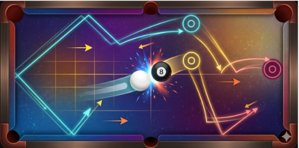

# DynaVisR: Benchmark for Visual Reasoning in Dynamic Environments

<p align="center">
 
</p>

<p>
 <a></a>
 <a></a>
 <a></a>
</p>

**DynaVisR-Billiards** is a procedural dataset generator for evaluating whether a model can combine:

1. **visual trajectory simulation**,
2. **bounce-indexed state updates**, and
3. **overlap and layer-order reasoning**.

Each example is a synthetic billiard world with a ball, a rectangular table, and named rectangular obstacles (`A–D`). 
The solver must mentally simulate the ball’s reflections while also applying visibility rules that change after specific bounce counts. 
At a queried moment, the solver must identify the next hit object, determine which obstacles are visible, 
and recover the bottom-to-top order of the visible overlapping subset.

## What this generator produces

For every generated example, the pipeline writes:

- a **question image** with the canonical board layout,
- an **answer image** with the trajectory up to the queried hit and the hit point marked,
- a **metadata text file** containing the prompt and gold answers,
- a **JSON record** for the single example,
- a **dataset.jsonl** file for the full split,
- a **manifest.json** file with per-file SHA-256 hashes and build metadata,
- **manifest.sha256** and **dataset.sha256** checksum files.

## Why this benchmark matters

This benchmark is designed to reduce shortcutting by requiring models to solve a coupled reasoning problem rather than classify 
a familiar static pattern.

A correct answer requires all of the following:

- exact reflection reasoning against walls and currently visible obstacles,
- correct application of visibility transitions after bounce counts,
- filtering to the visible subset at the queried moment,
- identifying which visible objects overlap,
- sorting those objects into bottom-to-top layers.

Because the generator computes gold answers by exact simulation and rejects ambiguous or low-clarity worlds, 
the resulting labels are precise and defensible.

## Reproducibility guarantees

The generator is designed for repeatable dataset creation.

### Deterministic controls

- The dataset is generated from an explicit `--seed`.
- JSON and JSONL output use deterministic key ordering.
- The output manifest sorts files deterministically.
- A clean output directory is required for reproducible builds.
- Every emitted file is hashed with SHA-256.

### Recommended build command

```bash
PYTHONHASHSEED=0 python billiard_benchmark_generator.py \
  --output-dir dataset/v1 \
  --num-examples 100 \
  --seed 7 \
  --snapshot-after-bounce 2 \
  --require-overlap-at-snapshot any
````

## Installation

**Clone the repository**

```bash
git clone https://github.com/akaliutau/dynavisr-bench.git
cd dynavisr-bench
```

**Create and activate a Conda environment**

```bash
conda create -n dynavisr python=3.12 -y
conda activate dynavisr
```

**Install dependencies**

```bash
pip install -r requirements.txt
```

## Quick start

Generate a dataset:

```bash
PYTHONHASHSEED=0 python billiard_benchmark_generator.py \
  --output-dir dataset/v1 \
  --num-examples 10 \
  --seed 7 \
  --snapshot-after-bounce 2
```

Convert the generated JSONL to a Kaggle-ready CSV:

```bash
python convert_jsonl_to_csv.py \
  dataset/v1/dataset.jsonl \
  dataset/v1/benchmark.csv \
  --image-folder image
```

## Output layout

```text
dataset/v1/
  ├── dataset.jsonl
  ├── dataset.sha256
  ├── manifest.json
  ├── manifest.sha256
  └── images/
      ├── 00000_question.png
      ├── 00000_answer.png
      ├── 00001_question.png
      └── 00001_answer.png
```

## Dataset schema

### `dataset.jsonl`

Each line is a JSON object with:

* `sample_id` — stable example identifier
* `image_path` — relative path to the question image
* `answer_image_path` — relative path to the answer visualization
* `metadata_txt_path` — relative path to the text metadata file
* `prompt` — natural-language task prompt
* `world` — serialized world configuration
* `answers.q1_hit_object` — gold label for the queried hit object
* `answers.q2_visible_objects` — visible objects at the queried moment
* `answers.q3a_visible_overlapping_objects` — visible objects that overlap at that moment
* `answers.q3b_layer_groups_bottom_to_top` — overlap-layer groups sorted from bottom to top
* `debug` — exact simulation details for auditing

### `manifest.json`

The manifest records:

* generator version,
* seed and generation parameters,
* Python and Pillow versions,
* `PYTHONHASHSEED`,
* source file hashes,
* per-file SHA-256 checksums for all payload files,
* aggregate dataset payload hash.

## Quality controls

The generator rejects worlds that are visually confusing or geometrically ambiguous. Rejection filters include:

* ambiguous simultaneous hits,
* corner collisions that are too close to obstacle or wall corners,
* trajectories that pass too close to obstacles without hitting them,
* short trajectory legs that are hard to inspect,
* unreadable same-orientation overlaps,
* crowded starts too close to walls or obstacles.

These filters improve label validity and visual legibility for both human inspection and model evaluation.

## Suggested benchmark positioning

This generator is best positioned as a benchmark for **Executive Functions**, with **Attention** as a secondary capability.

* **Executive Functions:** multistep planning, sequential rule application, and working-memory-like state maintenance
* **Attention:** tracking the currently relevant visible subset under dynamic updates

## Citation

If you use this generator in a benchmark, cite the repository or benchmark writeup and include the dataset seed, snapshot configuration, and dataset hash from `manifest.json`.

---

Built exclusively for:

Measuring Progress Toward AGI - Cognitive Abilities

Google DeepMind Hackathon

https://www.kaggle.com/competitions/kaggle-measuring-agi/writeups/dynamic-visual-reasoning


